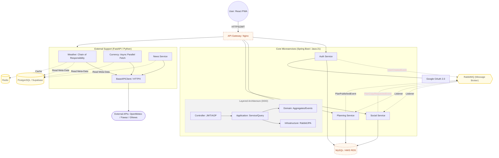

## System Architecture

> [!NOTE]
> **Architecture Roadmap & Status Indicators**
> To provide transparency on the development progress, this diagram uses the following visual cues:
> * <span style="color:#FFB5B5">**Red/Pink Text**</span>: **Pending Events** – Defined in the communication contract but logic implementation is in progress.
> * **Dashed Borders (Orange)**: **WIP Infrastructure** – Components currently being provisioned or earmarked for cloud migration (e.g., API Gateway, AWS RDS).
> * **Solid Borders**: **Fully Implemented** – Core logic and local containerization are complete.



## Features & Technical Highlights

### 1. Polyglot Microservices Architecture
- **Java / Spring Boot**: Handles core business logic (Planning, Social, Auth) with a focus on type safety and maintainability.
- **Python / FastAPI**: Manages external data aggregation (Weather, Currency, News) leveraging Python's rich ecosystem for third-party API integration.

### 2. Domain-Driven Design (DDD) Implementation
- Strictly separated into **Domain**, **Application**, and **Infrastructure** layers.
- Encapsulated business logic within Entities and Value Objects to ensure high cohesion and low coupling.

### 3. Resilience & Design Patterns
- **Chain of Responsibility (CoR)**: Implemented in the Weather service for seamless failover between multiple providers (Redis -> Open-Meteo -> OpenWeather).
- **Event-Driven Architecture (EDA)**: Utilizes **RabbitMQ** to decouple the `Planning` and `Social` services, ensuring eventual consistency when plans are published.
- **Caching**: Distributed caching with **Redis** to reduce external API latency and manage rate limits.

### 4. Security & DevOps
- **JWT & RSA Encryption**: Secure authentication using asymmetric key pairs for token signing.
- **Containerization**: Fully Dockerized environment with `docker-compose` for local development and AWS-ready deployment.

---

## Project Evolution Roadmap

- [x] **Phase 1: Infrastructure & Resilience**: Established Python/FastAPI services with Chain of Responsibility (CoR) pattern, Redis caching, and PostgreSQL integration (v3-v6).
- [x] **Phase 2: Mobile-First Experience**: Migrated to React and implemented PWA support with optimized data fetching using `useQuery` and `asyncio` (v4-v5).
- [x] **Phase 3: Core Domain Expansion**: Architected `Auth`, `Planning`, and `Social` services from scratch using **Spring Boot + DDD** to manage complex business logic (v7).
- [x] **Phase 4: Service Orchestration**: Integrated **RabbitMQ** for asynchronous event-driven synchronization between Java microservices (v7).
- [x] **Phase 5: Cloud Architecture (Legacy)**: Initial manual deployment to **AWS ECS (Fargate)**.
- [x] **Phase 6: Infrastructure as Code (IaC)**: Automated AWS foundation using **Terraform**, provisioning VPC (Public/Private), RDS, ECR, and **EKS** managed clusters.
- [x] **Phase 7: Cloud-Native Orchestration**: Deployed workloads to **EKS** using **Kustomize**, integrating **EBS CSI** for persistence and **ALB Ingress** for path-based traffic management.
- [ ] **Phase 8: Observability & Reliability Engineering**: (In Progress) Establishing full-stack monitoring with **Prometheus/Grafana**; performing **API stress tests** to benchmark service limits and optimize resource allocation.
- [ ] **Phase 9: Advanced Domain Logic**: Enhancing interactive logic between `Planning`, `Social`, and `Auth` services to handle complex travel collaboration scenarios.
- [ ] **Phase 10: Full-Stack Integration**: Developing dedicated React modules for core domains and connecting the PWA frontend to Spring Boot services via API Gateway.

---

## Live Demo & Deployment

- Frontend (PWA): https://traveling-helper.vercel.app/currency (Powered by Vercel).
- Utility Services (FastAPI): https://traveling-helper.onrender.com (Powered by Render).
- Core Microservices (Java Spring Boot):
  - **Architecture**: Deployed on AWS ECS (Fargate) with RabbitMQ event-driven synchronization.
  - **Data Layer**: Powered by AWS RDS (MySQL) and S3 for config storage.
  - **Infrastructure Status**: Successfully validated on AWS. To optimize hosting costs, the live ECS tasks are toggled based on active demonstration needs.

---

## Getting Started (Core Microservices)

### Prerequisites
- Docker & Docker Compose
- Java 21+

### 1. Clone the repository
```bash
# Git Clone
git clone https://github.com/ChengenHsieh0225/traveling-helper.git

# Move to the root directory of the core microservices
cd traveling-helper/backend-java

```

### 2. Security Setup (Required)
The `auth-service` requires Google OAuth credentials and RSA keys for JWT signing.

#### A. Google Auth
Obtain `CLIENT_ID` and `CLIENT_SECRET` from the Google Cloud Console. 

#### B. RSA Key Generation
Generate the asymmetric keys required for secure token handling:
```bash
# 1. Generate the master private key file
openssl genrsa -out private_key.pem 2048

# 2. Generate Private Key Base64 (PKCS#8 DER format)
openssl pkcs8 -topk8 -inform PEM -outform DER -in private_key.pem -nocrypt | base64 | tr -d '\n ' && echo ""

# 3. Generate Public Key Base64 (SubjectPublicKeyInfo DER format)
openssl rsa -in private_key.pem -pubout -outform DER | base64 | tr -d '\n ' && echo ""

# (Optional) Clean up the pem file after copying the strings
rm private_key.pem
```

### 3. Environment Configuration
Please set up your environment variables before starting:
```bash
# Copy the example environment file
cp .env.example .env

# Open .env and fill in your credentials (including the base64 key strings)
# (You can use any text editor like vim, nano, or VS Code)
vim .env
```

### 4. Running with Docker
This will orchestrate the core ecosystem, including Auth, Planning, and Social services, along with RabbitMQ and MySQL:
```bash
# Start all core services in detached mode
docker-compose up -d
```

### 5. Verification
Once the containers are up and healthy, you can access the service APIs at:
- Auth Service: http://localhost:8080
- Planning Service: http://localhost:8081
- Social Service: http://localhost:8082
